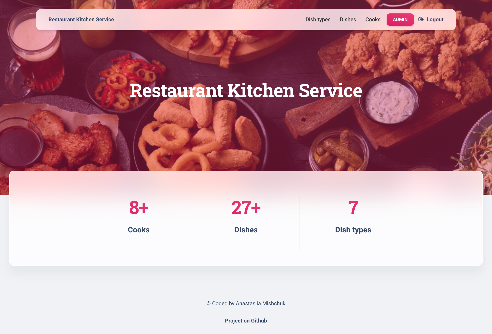

# Restaurant kitchen service

Django project for managing dishes and cooks in Restaurant.

## Check it out!

[Restaurant project deployed to Render](https://restaurant-kitchen-service-3kw4.onrender.com)

## Installation

Python3 must be already installed

```shell
git clone https://github.com/anastmishchuk/restaurant-kitchen-service.git
cd restaurant-kitchen-service
python3 -m venv venv
source venv/bin/activate
pip install -r requirements.txt
python manage.py runserver #starts Django Server
```

## Features

* Registration & authentication functionality for Cook/User
* Managing dishes, cooks & dish types directly from website interface
* Admin panel for advanced managing

## Demo


